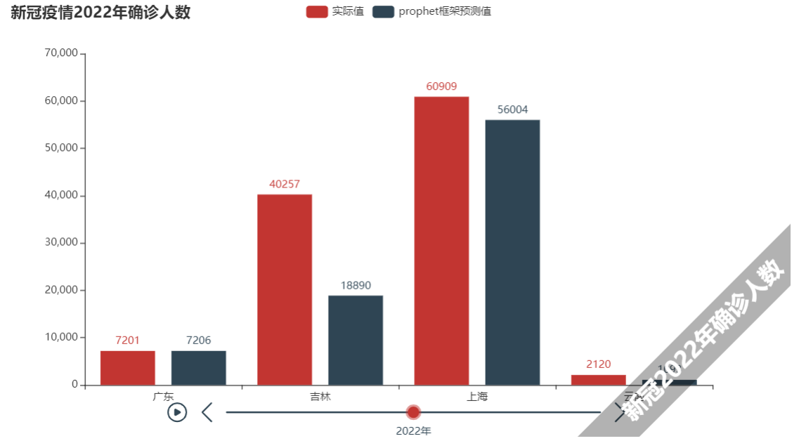

# Covid-19-Analysis
## File structure
```python
├── dataset # data searched from APIs and websites
│   ├── data_predict # data predicted by models
│   │   ├── LSTM
│   │   └── SIR
│   ├── data_xyz # data from xyz
│   │   ├── provinceData
│   │   └── worldData
│   ├── data_zrh # data from zrh
│   │   └── baidu
│   │       ├── BJ
│   │       └── SH
│   ├── vaccinate # vaccinate data
│   └── visualize # visualization
│       └── data
└── model # models like SIR, LSTM, prophet and others
    ├── ARIMA
    ├── cluster
    ├── LSTM
    ├── prophet
    ├── SEIR
    ├── SIR
    └── xgboost
```

## Dataset
### data_predict
**LSTM**

 predicted data from LSTM

**SIR**

predicted data from SIR

> other models' predictions are in model directory

### data_xyz
Total data of Covid-19, including cure count, confirmation count, death count and so on.

**provinceData**

Data of 34 provinces in China

**worldData**

Data of all countries around the world

> other files act as supplements

### data_zrh

Supplementary data for `data_xyz`

### vaccinate

Data about vaccination

### visualize

visualization of data, please read `Visualization` section.

### others

`aging_rate_2021.csv`: aging rates of provinces in China

`gdp_2021.csv`: GDP of Chinese provinces

`population7th.csv`: Chinese provinces' populations

`population_density.csv`: Chinese provinces' population density

## Visualization

> dataset/visualize

### Visualization of original data

Run `analysis_visaulization.py`

**Requirements**

```shell
pip install streamlit
pip install pydeck
```

**Run**

```shell
# had better run in Windows, in Linux you need to install more dependencies
streamlit run analysis_visaulization.py 
```

**Result**

Result will show in web page


### Visualization of prediction

Run `predict_visualize.ipynb`

**Result**

Four files will be generated in current directory: 

`moxing_guangdong.html`

prediction' error in Guang Dong in 2022 of SIR


`timeline_bar_with_graphic.html`

prediction and ground truth in 2022 of prophet model



`prophet_predict.html`

Leveraging prophet model to simulate spread of pandemic from 2020 to 2022 in China without  using ground truth. We suppose the pandemic erupts in HuBei initially.


## Models


## Research

### SIR & SEIR

SIR： 

- https://www.bilibili.com/video/av716869695
- https://zhuanlan.zhihu.com/p/496661721

SEIR: 

- https://blog.csdn.net/Program_dancing/article/details/106321348

- https://zhuanlan.zhihu.com/p/142117573

SEIQR: https://zhuanlan.zhihu.com/p/496912619 

### ARIMA

ARIMA: https://www.bilibili.com/video/BV1Zz411e78y?spm_id_from=333.337.search-card.all.click

### LSTM

LSTM：https://curiousily.com/posts/time-series-forecasting-with-lstm-for-daily-coronavirus-cases/

### Others

上海交通大学团队开发数学模型： https://www.cn-healthcare.com/article/20220413/wap-content-568537.html

全国老龄化地图: https://www.163.com/dy/article/H5NUAR5K0515UN97.html
